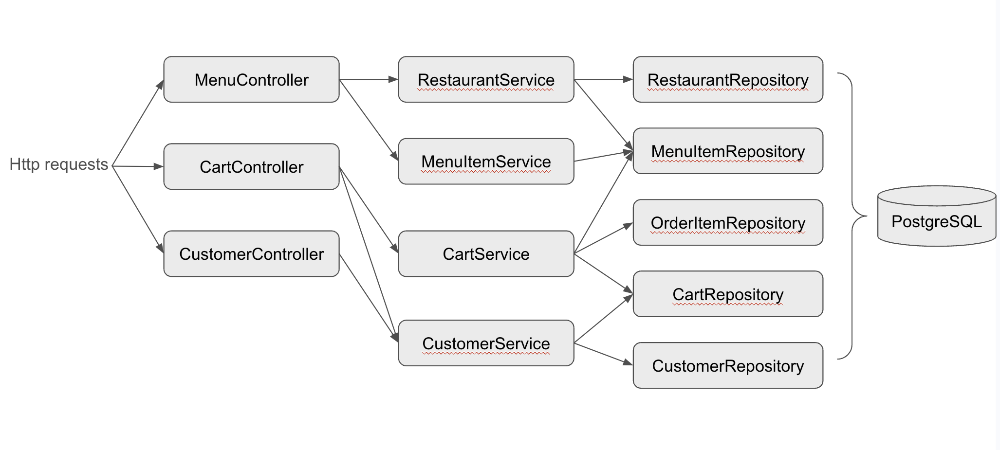

# Online Food App
## Introduction
This is a full-stack project about developing an online food ordering system based on Spring boot and React. The app is further deployed on AWS (the link to the web service: https://je6kigmgk2.us-east-2.awsapprunner.com/). Main functions of the app include:
- User registration
- Restaurant menu search
- Add menu items to the shopping cart
- Checkout

## Design

